class: inverse, middle

# Outline

* Motivation: Why use R Markdown?

* History of R Markdown

* Introduction to R Markdown

* Using R Markdown

  * Bibliographies/Citations
  * Cross-referencing within documents
  * The **rticles** package and journal templates
  * R package vignettes
  * Presentation Slides (Like these!)

???

* Not a tutorial
* Breadth over Depth
* Just enough exposure that you will know what tools exist
* **talk about my philosophy**
* **cater to both people who have experience and those who do not**

---

# Why use R Markdown?


```{r, echo = FALSE}
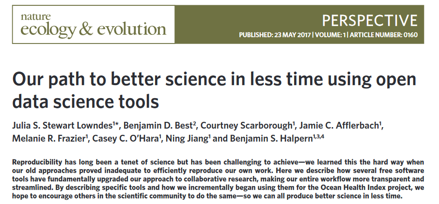
```

???

* Scientific Framework to quantify ocean derived benefits to humans and to help inform sustainable ocean management

* Ocean Health Index requires synthesizing data from many heterogeneous sources

* Every year since 2012 we have repeated Ocean Health Index (OHI) methods to track change in global ocean health

---
# Why use R Markdown?


```{r, echo = FALSE, out.width = "80%"}
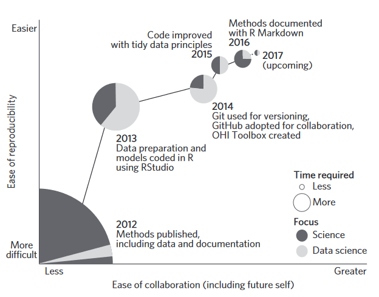
```

---

# Why use R Markdown?

```{r, echo = FALSE}
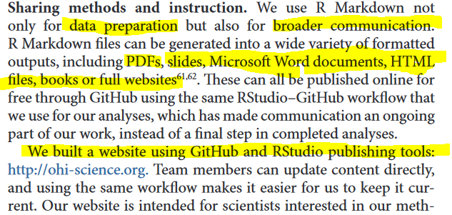
```

---
class: inverse, center, middle
# A brief history of R Markdown


---


background-image: url("images/donald_knuth.jpeg")
background-size: contain


???

The Art of Computer Programming
TeX
Leslie Lamport

---

# Literate Programming


**"Let us change our traditional attitude to the construction of programs: Instead of imagining that our main task is to instruct a            computer what to do, let us concentrate rather on explaining to human beings what we want a computer to do."**


-Donald Ervin Knuth, Literate Programming

--

```{r, echo = FALSE, warning = FALSE}
# install.packages("DiagrammeR")
library(DiagrammeR)
grViz("digraph flowchart {
      # node definitions with substituted label text
      node [fontname = Helvetica, shape = rectangle]        
      tab1 [label = '@@1']
      tab2 [label = '@@2']
      tab3 [label = '@@3']


      # edge definitions with the node IDs
      tab1 -> tab2
      tab1 -> tab3
      }

      [1]: 'Literate Program'
      [2]: 'Documentation'
      [3]: 'Source Code'

      ")
```


---

# The Software Comprehension Problem

* **Maintenance:** How can we reduce time spent understanding code?
* **Motivation:** How can we motivate programmers to document well?

--

$$\\[1in]$$

<big>Literate programs are "psychologically <b>arranged for comprehension</b> by humans".

They "provide significant incentives for programmers to <b>document</b> their understanding." 

--

...For our purposes, literate programming encourages **reproducible research!**

.small[Quotes are from **Towards Modern Literate Programming** by Smith and Churcher.]
---
# Early example: Donald Knuth's WEB

```{r, echo = FALSE}
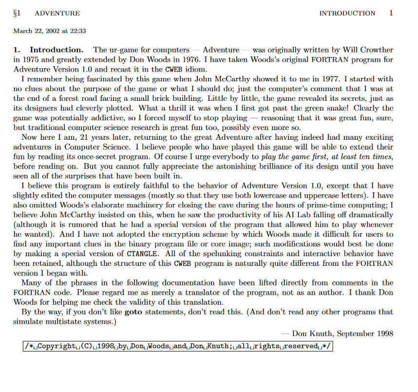
```

---
# Early example: Donald Knuth's WEB
```{r, echo = FALSE}
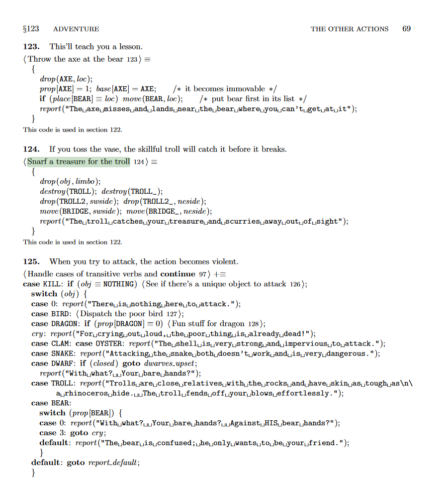
```

---
# Early example: Donald Knuth's WEB
```{r, echo = FALSE}

```


---
# Early example: Donald Knuth's WEB
.pull-left[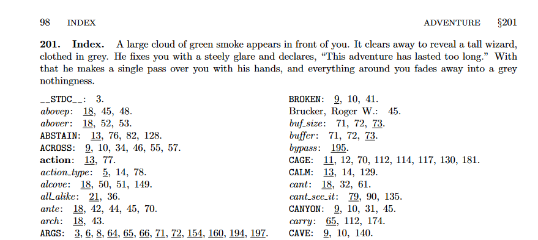 ]
.pull-right[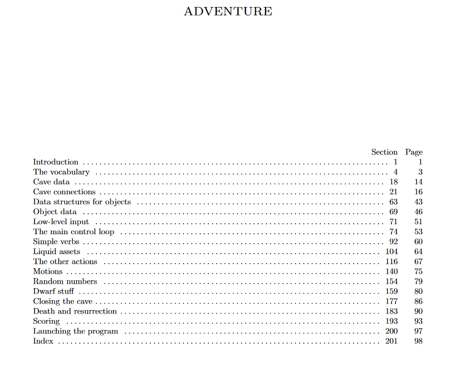 ]
---
class: inverse, center, middle
# What is R Markdown?

---
# Geneology of R Markdown

$$\\[1.5in]$$


* **knitr**

* **Markdown**

* **Pandoc**


---
# knitr 
```{r}
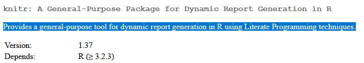
```

(from https://cran.r-project.org/web/packages/knitr/index.html)
---
# knitr
```{r, out.width = "90%"}
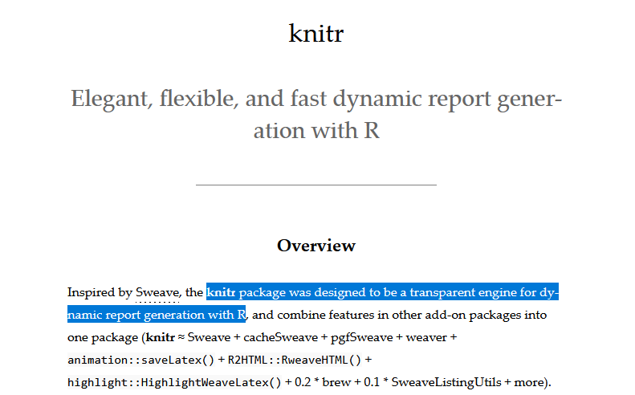
```
(from https://yihui.org/knitr/)

---

# Markdown


```{r, echo = F}
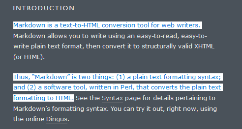
```

(from https://daringfireball.net/projects/markdown/)


???

Markup is often used to control the display of the document. A markup language is a set of rules governing what markup information may be included in a document and how it is combined with the content of the document in a way to facilitate use by humans and computer programs. The idea and terminology evolved from the "marking up" of paper manuscripts (i.e., the revision instructions by editors).


---

# Markdown

```{r, echo = F}
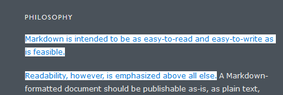
```

(from https://daringfireball.net/projects/markdown/syntax)


---
# Pandoc

$$\\[1in]$$

```{r, echo = F}
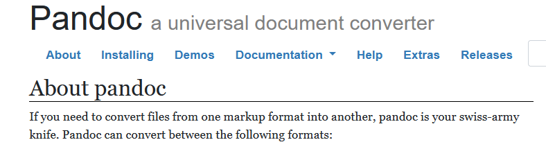
```
(from https://pandoc.org/index.html)
---
# Summary so far


R Markdown...

* ... aids in **reproducibility** and **collaboration**

* ... is an implementation of **literate programming**
 
* ... originated in the **knitr** package

  * embeds code chunks in in **Markdown documents**
  
* ... uses **Pandoc** to convert Markdown documents to many output formats

$$\\[0.5in]$$

```{r, echo = F}
knitr::include_graphics("./images/RMarkdown_nutshell.PNG")
```

(from https://bookdown.org/yihui/rmarkdown/)

---

```{r, echo = FALSE, out.width = "100%", fig.align = "center"}
knitr::include_graphics("images/final_output_diagram.png")
```


---
class: inverse, middle, center
# Examples

---
background-image: url("images/EmployeeHealthCover.PNG")
background-size: contain

# Books

???

The 2017 Employer Health Benefits Survey was designed and analyzed by the Kaiser Family Foundation, NORC at the University of Chicago, and Health Research & Educational Trust. The full PDF report was written in R Markdown (with the bookdown package)

---
background-image: url("images/OceanHealthWebsite.PNG")
background-size: contain

# Websites
---
background-image: url("images/Rmarkdown_homework.PNG")
background-size: contain

# Homework
---
background-image: url("images/Rmarkdown_journal.PNG")
background-size: contain

# Journal Articles
---
class: inverse, center, middle

# Introduction to R Markdown 

You will want R and R Studio.

---
# Installation

You will want to install the **rmarkdown** package in R using `install.packages('rmarkdown')` in R.

If you want to generate PDF output, you will need to install LaTeX. One recommendation is to install **TinyTeX** using `install.packages('tinytex')`.


---
# Creating an R Markdown Document

.pull-left[
```{r, echo = FALSE}
knitr::include_graphics("images/new_Rmd_doc.PNG")
```
]
.pull-right[
```{r, echo = FALSE}
knitr::include_graphics("images/new_Rmd_doc2.PNG")
```
]

---
# An R Markdown Document

```{r, echo = FALSE}
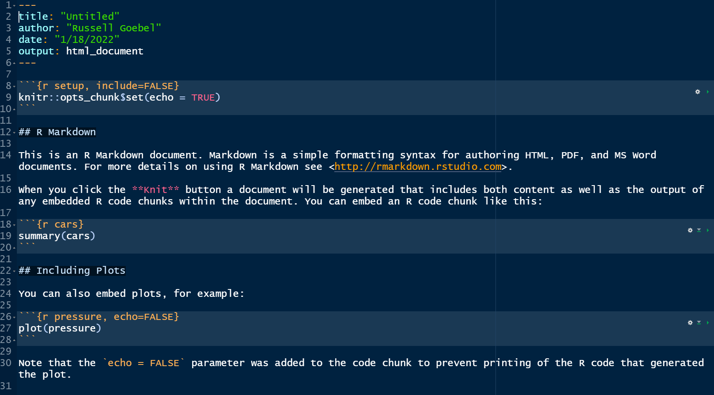
```


---
# Knit

.pull-left[
```{r, echo = FALSE}
knitr::include_graphics("images/knit.PNG")
```
]
.pull-right[
```{r, echo = FALSE}
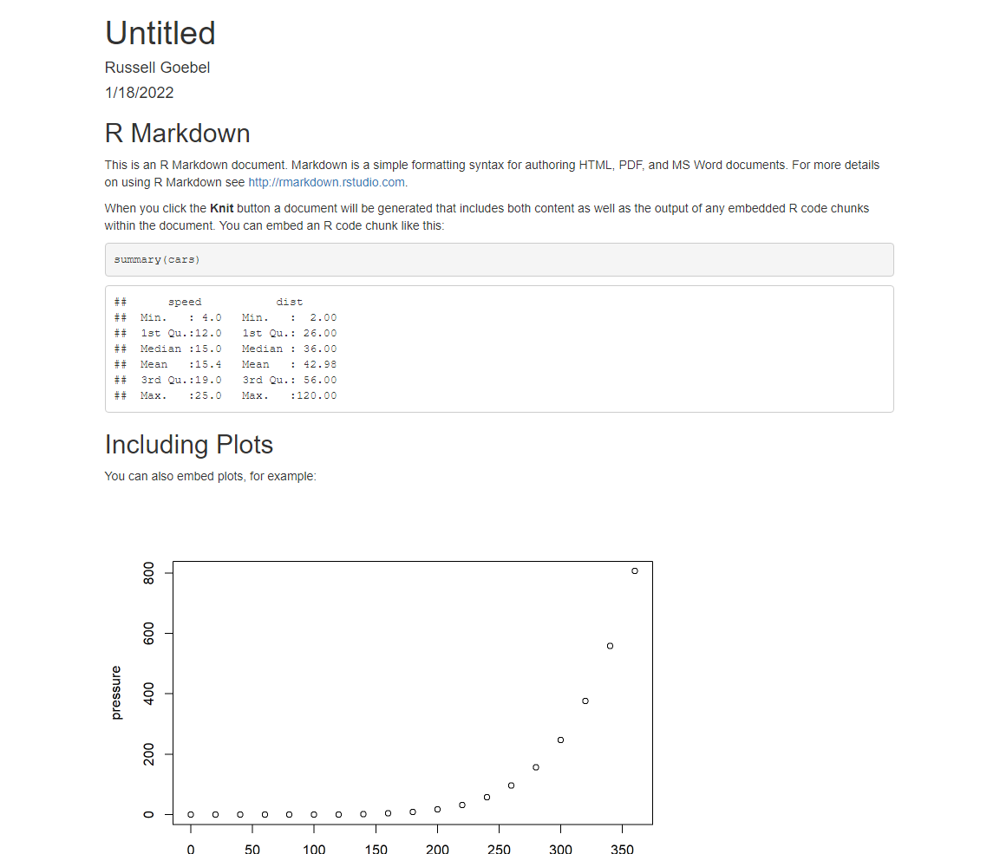
```
]

---
# Important tip: use cheatsheets!

```{r, echo = FALSE}
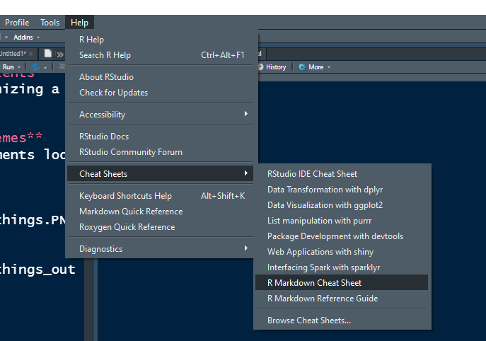
```
---
background-image: url("images/cheatsheet_big.PNG")
background-size: contain
# Cheatsheet
---
background-image: url("images/cheatsheet_source_editor.PNG")
background-size: contain
# Cheatsheet

---
# Components
.huge[
There are **three** main components of an R Markdown document:

* **Metadata**

* **Text**

* **Code**
]
---


background-image: url("images/Rmarkdown_components.PNG")
background-size: contain

# An R Markdown Document
---
# Metadata: YAML

<big>YAML (YAML Ain't Markup Language)

.pull-left[ Code:
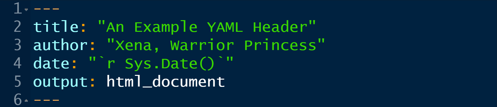 ]
.pull-right[Output:
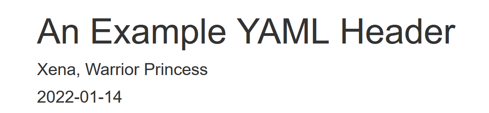 ]

* Indentation matters
* You can run code here! (e.g,`Sys.Date()`)


---

# Output formats

Documentation for many output formats can be found at https://bookdown.org/yihui/rmarkdown/documents.html. 

* `html_document`

* `html_notebook`

* `pdf_document`

* `word_document`

* `html_vignette` (R package vignette)

* `odt_document` (OpenDocument Text document)

* `rtf_document` (Rich Text Format document)

* `md_document` (Markdown document)


---
# Metadata: Example 

Often, a **table of contents** goes a long way in organizing a document.

Some formats allow **themes** that can help your documents look nice. 

.pull-left[ Code:
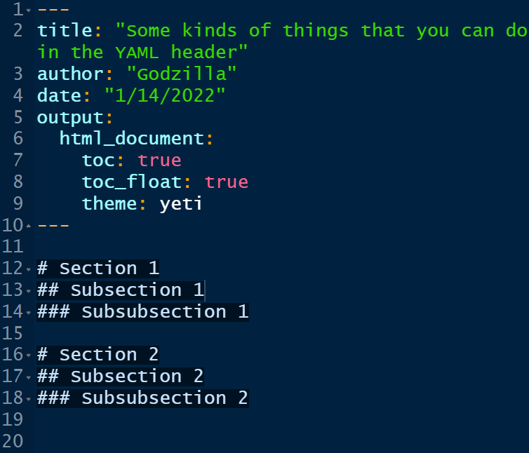 ]
.pull-right[Output:
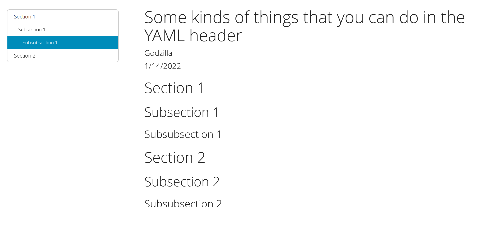 ]


---
background-image: url("images/cheatsheet_YAML.PNG")
background-size: contain

# Cheatsheet: YAML

---
# Text

.pull-left[
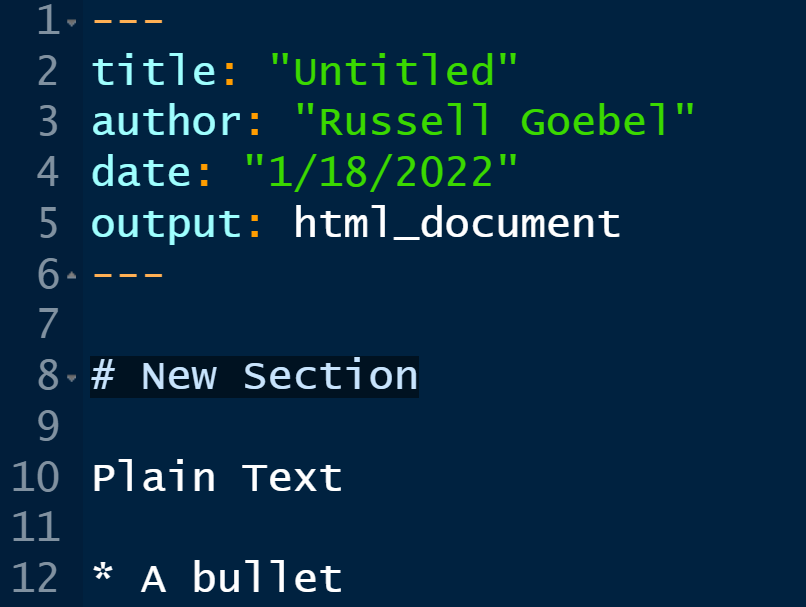 ]
.pull-right[
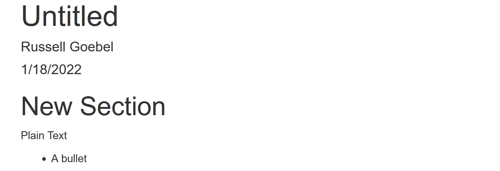 ]

---
# Text: Markdown

.pull-left[
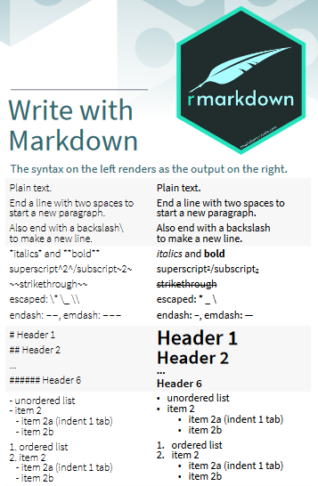 ]
.pull-right[
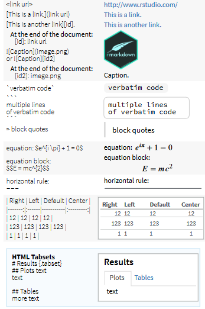 ]

---

# html tabsets 

```
# Section Title { .tabset}

## A tab

## Another tab
```

```{r, echo = FALSE}
knitr::include_graphics("images/tabsets1.png")
```
---


background-image: url("images/tabsets2.png")
background-size: contain

# html tabsets
---


background-image: url("images/tabsets3.png")
background-size: contain

# html tabsets

---
# Text in html or LaTeX formats

.pull-left[
  .big[**For LaTeX output formats:**]
  
  * LaTeX code can be used to customise appearance
  
  * LaTeX **tables** can be used:
  
  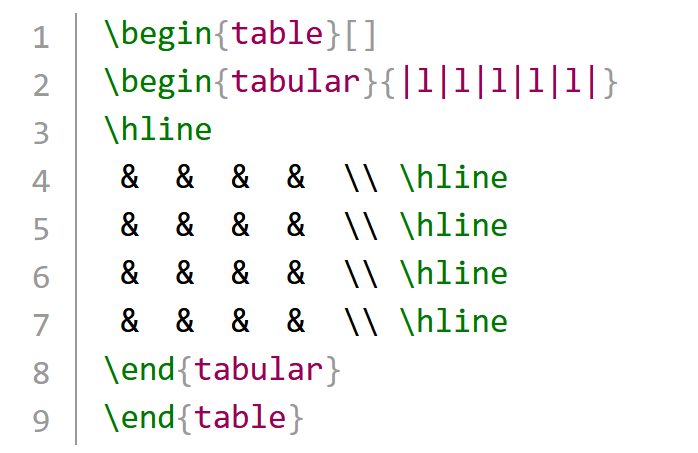 
  
  .small[better: `knitr::kable(data,format = "latex")`]
  
]
.pull-right[.big[**For html output formats:**]
  * **CSS** can be used to customise appearance
  
    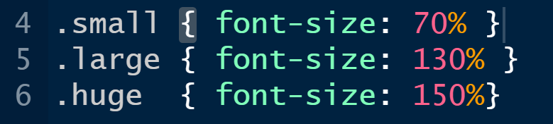
    
  * HTML **tabsets** can be used
  
  
  * Enables some interaction (such as **plotly**)
]

To check you can use `knitr::is_html_output()` or `knitr::is_latex_output()`.

---
# Warning!
$$\\[1 in]$$
.large[Always consider **transferability**.

A single source document can create documents with multiple formats.


Tailoring to a single output format (like html or pdf) may be at the expense of this transferability.

]


(https://bookdown.org/yihui/rmarkdown-cookbook/latex-output.html)


---
# Code: chunks

```{r, echo = FALSE}
knitr::include_graphics("images/code_chunks.png")
```
**Shortcut**: Ctrl + Alt + I (OS X: Cmd + Option + I)

???

* Mention Chunk Label
* Mention Options

---
# Chunks

```{r, echo = FALSE, out.width = "30%", fig.align = "center"}
knitr::include_graphics("images/chunks.png")
```

```{r, echo = FALSE, out.width = "75%", fig.align = "center"}
knitr::include_graphics("images/chunks_output.png")
```


---
# Chunk options

```{r, out.width = "70%", echo = FALSE, fig.align = "center"}
knitr::include_graphics("images/chunk_options.png")
```

---
# Setting Global Options

It can be helpful to set global options:


`````

```{ r setup, include=FALSE}
knitr::opts_chunk$set(echo = TRUE)
```

`````


---
# Chunk options RStudio shortcut
$$\\[1.5in]$$

```{r, echo = FALSE}
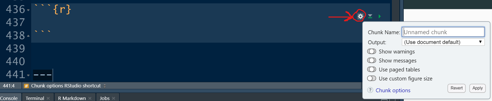
```


---

# Option: child

Organize lengthy documents using `child`:

```{r, echo = FALSE}
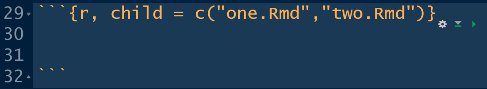
```


More information here: https://bookdown.org/yihui/rmarkdown-cookbook/child-document.html
---
# Options can contain expressions

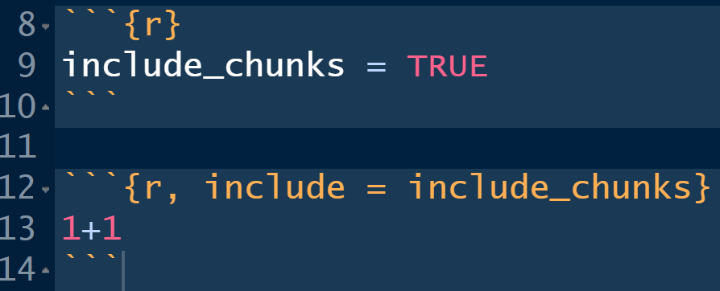

---
# knitr::kable()

Place this function in an **R chunk** to render a table programatically:

```{r}
my_data_frame = data.frame(A = 1:5, B = 6:10)
knitr::kable(my_data_frame) # makes a table
```


---
# knitr::kable tip

If you are generating a table using data in R, `knitr::kable` can be used in the console to print LaTeX code for that table!

```{r, echo = FALSE, out.width = "70%", fig.align = "center"}
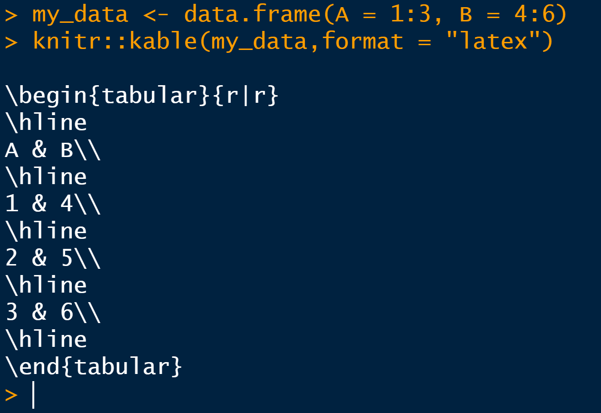
```

---

# Inline Code

```{r, echo = FALSE}
knitr::include_graphics("images/inline_code.png")
```

---
# Other Languages (Python, C++, etc)

Other programming languages than R can be run:

```{r, echo = FALSE, out.width = "80%"}
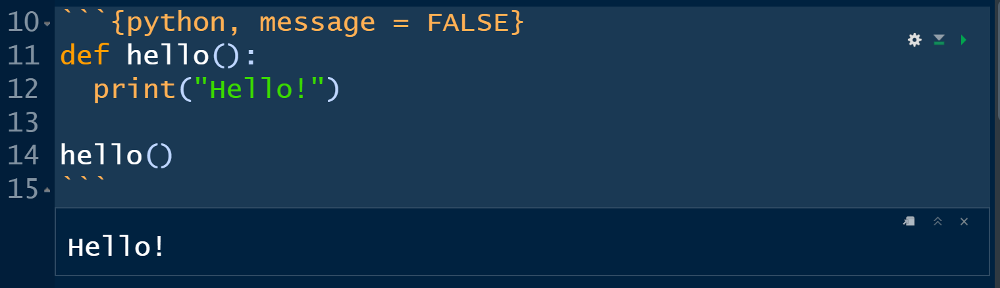
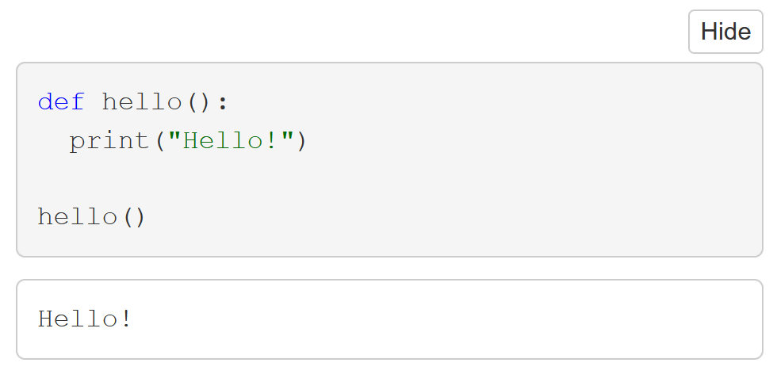
```

---
A list of supported languages can be obtained using `knitr::knit_engines()`:

```{r, echo = FALSE, out.width = "40%", fig.align = "center" }
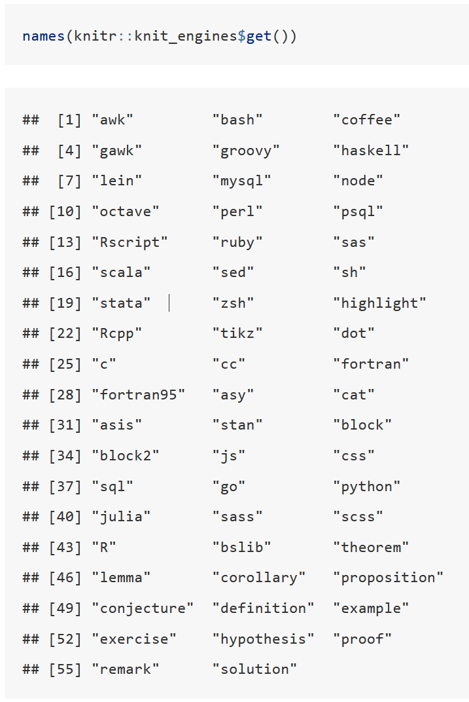
```

???

* SQL, Julia, Python, Rccp

---
# Summary so far:

* An R Markdown document consists of **metadata**, **text** and **code**.

* The **YAML** header controls things like title/author, output format, or output options

  * include a floating table of contents in an html document with `toc: true` and `toc_float: true`, or change the theme 

* Text uses **markdown** syntax, but depending on the output format, you might be able to use LaTeX, CSS or html as well.
  
  * Keep transferability in mind!
  
* **Chunks** can be included to show and run code
  * Use chunk options to customize how code interacts with your document
  
  * Chunk options can include R expressions

  * The code can be from one of many languages (such as Python)
  

---
class: inverse, middle, center
# Using R Markdown

Bibliographies and Citations 

Cross-referencing within a document

The **rticles** package 

R Package Vignettes

Presentations

---
class: inverse, middle, center

# Bibliographies and Citations

---
# Bibliographies and Citations


* We will need to create a new **.bib** file

* We will need to adjust the **YAML** header

* We can then reference using syntax similar to in LaTeX.


---
# Bibliographies and Citations


.pull-left[**YAML Header:**
```
---
output: html_document
bibliography: references.bib  
---
```

...or, to use **natbib/biblatex:**
```
output:
  pdf_document:
    citation_package: natbib
  bookdown::pdf_book:
    citation_package: biblatex

```
]
.pull-right[
**.bib entries:**
```
@Book{Guide,
    title = {R Markdown: The Definitive Guide},
    author = {Yihui Xie and J.J. Allaire and Garrett Grolemund},
    publisher = {Chapman and Hall/CRC},
    address = {Boca Raton, Florida},
    year = {2018},
    note = {ISBN 9781138359338},
    url = {https://bookdown.org/yihui/rmarkdown},
  }

```
]

See: https://bookdown.org/yihui/rmarkdown-cookbook/bibliography.html

???


Mention the Key


---
# Bibliographies and Citations

To cite an entry, use `@key` or `[@key]`. 

* `@key` renders without parentheses, e.g. `@Guide` renders as Xie, Allaire, and Grolemund (2018).

* `[@key]` renders with parentheses, e.g. `@Guide` renders as (Xie, Allaire, and Grolemund 2018).
---
# Bibliographies and Citations

To change **style**, an additional line should be included:

```{r, echo = FALSE}
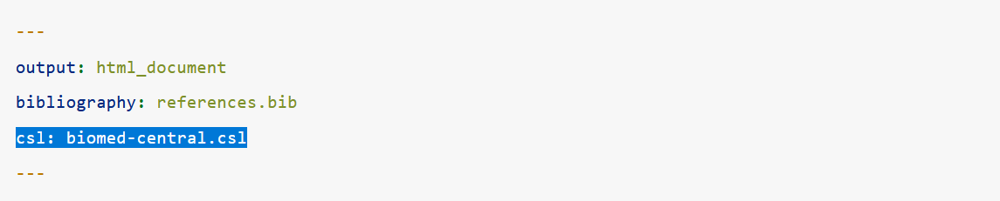
```

Here `csl` stands for "Citation Style Language".


---
class: inverse, middle, center

# Cross-referencing


---
# Cross-referencing within a document

 We can reference **chunks** (tables and figures), **sections**, and **equations** in `bookdown` output formats

  * **bookdown** extends Pandoc
  
  * Examples of bookdown formats are `bookdown::pdf_document2` or `bookdown::html_document2`.


---
# For Bookdown Formats

Examples of bookdown formats are `bookdown::pdf_document2` or `bookdown::html_document2`.

You can most easily reference **chunks** and **sections**. 

* Recall that we can create **figures** or **tables** in chunks!

**Syntax:** 

* Figure `\@ref(fig:chunk-name)`
* Table `\@ref(tab:chunk-name)` 
* Section `\@ref(slug)`

.pull-left[
`````
```{ r chunk-name}
knitr::kable(data.frame(a = 1:3, b = 4:6))
```
`````
]
.pull-right[
```{r, echo = FALSE}
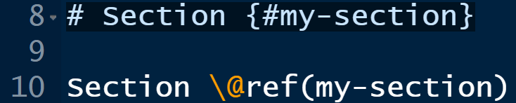
```
  
]

---
# Equations in Bookdown formats

Assign labels using `(\#eq:label)` and reference using `\@ref(label)`. For instance,

````
\begin{equation} 
  f\left(k\right) = \binom{n}{k} p^k\left(1-p\right)^{n-k}
  (\#eq:binom)
\end{equation} 
````
$$\begin{equation} 
  f\left(k\right) = \binom{n}{k} p^k\left(1-p\right)^{n-k}
\end{equation}$$

can be referenced using `\@ref(eq:binom)`.  

This **only works in bookdown formats** to the best of my knowledge. 

Not to be confused with using LaTeX syntax in LaTeX output formats.

(See: https://bookdown.org/yihui/bookdown/markdown-extensions-by-bookdown.html)


---
class: inverse, middle, center

# The **rticles** package for academic journals


---
# Academic Journals

The **rticles** package is designed to simplify the creation of documents that conform to submission standards.

This package provides **templates** like this one:

```{r, echo = FALSE, out.width = "50%", fig.align = "center"}
knitr::include_graphics("images/rticles_template.png")
```
---
# List of Supported Journals
```{r, echo = FALSE, out.width = "50%", fig.align = "center"}

options(width = 300)
```

<center>
```{r, out.width = "50%"}

rticles::journals()
```

???

* American Statistical Association

* Journal of Statistical Software

---
# Using Templates

.pull-left[
```{r, echo = FALSE, out.width = "50%"}
knitr::include_graphics("images/rticles_template_navigate1.PNG")
```
]
.pull-right[
```{r, echo = FALSE, out.width = "100%"}
knitr::include_graphics("images/rticles_template_navigate2.PNG")
```
]


---
# Example: JSS

```{r, echo = FALSE, out.width = "70%"}
knitr::include_graphics("images/JSS_template.png")
```

---
class: inverse, middle, center

# R Package Vignettes

(very briefly)


---
# R Package Vignettes

There is some synergy between R Markdown and R packages! 

* For info about R Packages, see: https://r-pkgs.org/index.html

* In https://r-pkgs.org/vignettes.html there is a **simple workflow** to generate html vignettes for R packages. We won't go into it here.

???

By Hadley Wickham and Jenny Bryan

---
# Example Vignette

Use `browseVignettes(package name)` to see vignettes for a package. Here is an example from dplyr:


```{r, echo = FALSE, out.width = "50%", fig.align = "center"}
knitr::include_graphics("images/dplyr_vignette.png")
```
---
class: inverse, middle, center

# Presentations


---
# Presentations

```{r, echo = FALSE, out.width = "70%", fig.align = "center"}
knitr::include_graphics("images/new_presentation.PNG")
```
---
# What's the difference?

* **Slidy:**
  * Many features for fancy slides and great online resources
  * A bit complicated / time consuming
  
* **Ioslides**
  * Easy to understand
  * For more features CSS code is needed

* **Beamer:**
  * Beamer
  * Beamer
  
* **Powerpoint**
  * Creates Powerpoint slides when you knit!


---
background-image: url("images/presentation_slidy.png")
background-size: contain

# Slidy


---
background-image: url("images/presentation_slidy_output1.png")
background-size: contain

# Slidy


---
background-image: url("images/presentation_slidy_output2.png")
background-size: contain

# Slidy


---
background-image: url("images/presentation_slidy_output3.png")
background-size: contain

# Slidy
---
background-image: url("images/presentation_slidy_output4.png")
background-size: contain

# Slidy
---
background-image: url("images/presentation_slidy_output5.png")
background-size: contain

# Slidy
---
background-image: url("images/presentation_ioslides_output1.png")
background-size: contain

# Ioslides

---
background-image: url("images/presentation_ioslides_output2.png")
background-size: contain

# Ioslides


---


background-image: url("images/presentation_ioslides_output3.png")
background-size: contain

# Ioslides

---
background-image: url("images/presentation_ioslides_output4.png")
background-size: contain

# Ioslides

---
background-image: url("images/presentation_ioslides_output5.png")
background-size: contain

# Ioslides
---
# Other presentation formats

Other formats include **reveal.js** and **xaringan**

This presentation is in Xaringan.
---
# Resources

** R Markdown Definitive Guide: ** https://bookdown.org/yihui/rmarkdown/

** R Markdown Cookbook: ** https://bookdown.org/yihui/rmarkdown-cookbook/

** knitr: ** https://yihui.org/knitr/

** Markdown: ** https://daringfireball.net/projects/markdown/

** Pandoc: ** https://pandoc.org/

** R Packages: ** https://r-pkgs.org/

** Donald Knuth's website: ** https://www-cs-faculty.stanford.edu/~knuth/

** Our Path to Better Science Paper: ** https://www.nature.com/articles/s41559-017-0160

** Ocean Health Index Website:** https://ohi-science.org/

---

class: inverse, center, middle

# Questions?

---
class: inverse, center, middle

# Thank you!